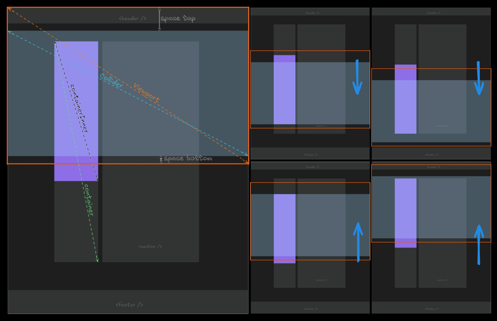
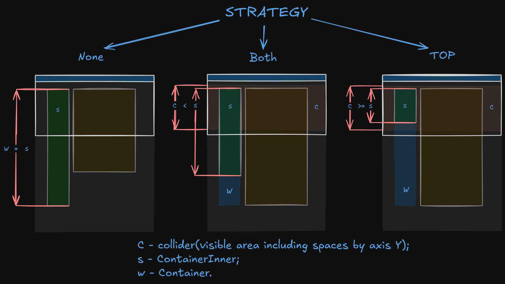

# Sidebarius

[](./LICENSE)
[](https://github.com/phenomenonus/sidebarius)


**Sidebarius** is a **lightweight**, **dependency-free** JavaScript tool for creating a "sticky" sidebar that adapts to scroll movements. This allows for dynamic interfaces with elements that stay in view as the user scrolls the page.

## [Demo](https://phenomenonus.github.io/sidebarius/) 👈

## Table of Contents

- [Installation](#installation)
- [Usage](#usage)
  - [Vanilla JS](#vanilla-js)
  - [React Typescript](#react-typescript)
- [API](#api)
- [Limitations](#limitations)
- [Development](#development)
  - [Commit Message Guidelines](#commit-message-guidelines)
- [Links](#links)
- [Copyright and license](#copyright-and-license)

---

## Installation

Install the package via npm:

```bash
npm install sidebarius
```

---

## Usage

### Vanilla JS

```html
<main>
  <aside id="container">
    <div id="container_inner"><!-- Sidebar content --></div>
  </aside>
  <section><!-- Section content --></section>
</main>

<!-- Import globally, or use ES Modules as shown below -->
<!-- <script src="./sidebarius.iife.min.js"></script> -->

<script type="module">
  import Sidebarius from './sidebarius.esm.min.js'; // Or use the global import (see commented line above)

  const sidebarius = new Sidebarius(
    document.getElementById('container'),
    document.getElementById('container_inner'),
    16, // spaceBottom (optional, default is 0)
    16, // spaceTop (optional, default is 0)
    callback, // optional callback
  );

  sidebarius.start();

  function callback(state, direction, strategy) {
    console.log('STATE: ' + ['None', 'ContainerBottom', 'ColliderTop', 'ColliderBottom', 'TranslateY', 'Rest'][state]);
    console.log('DIRECTION: ' + ['None', 'Down', 'Up'][direction]);
    console.log('STRATEGY: ' + ['None', 'Both', 'Top'][strategy]);
  }
</script>
```

> [Latest release](https://github.com/phenomenonus/sidebarius/releases/latest/)

---

### React Typescript

```ts
import React, { useRef, useEffect, FC, HTMLAttributes, CSSProperties } from 'react';
import Sidebarius from 'sidebarius';

type SidebarContainerProps = Omit<HTMLAttributes<HTMLElement>, 'style'> & {
  style?: Omit<CSSProperties, 'padding'>;
};

type SidebarContainerInnerProps = Omit<HTMLAttributes<HTMLDivElement>, 'style'> & {
  style?: Omit<CSSProperties, 'margin'>;
};

interface SidebarProps {
  container?: SidebarContainerProps;
  containerInner?: SidebarContainerInnerProps;
}

const Sidebar: FC<SidebarProps> = ({ container = {}, containerInner = {}, children }) => {
  const containerRef = useRef<HTMLElement | null>(null);
  const containerInnerRef = useRef<HTMLDivElement | null>(null);

  useEffect(() => {
    if (!containerRef.current || !containerInnerRef.current) return;

    const sidebarius = new Sidebarius(
      containerRef.current,
      containerInnerRef.current,
      16, // spaceBottom
      16, // spaceTop
    );

    sidebarius.start();

    return () => {
      sidebarius.stop();
    };
  }, []);

  return (
    <aside ref={containerRef} {...container}>
      <div ref={containerInnerRef} {...containerInner}>
        {children}
      </div>
    </aside>
  );
};

export default Sidebar;
```

---

## API

| Method                             | Description                                                 |
| ---------------------------------- | ----------------------------------------------------------- |
| `start()`                          | Starts the sticky scrolling behavior.                       |
| `stop()`                           | Stops the sticky scrolling behavior.                        |
| `setSpaces(bottomSpace, spaceTop)` | Sets the distance to the collider and triggers a re-render. |

---

### Constructor Parameters

```javascript
constructor(
  container: HTMLElement,
  containerInner: HTMLElement,
  spaceBottom: number = 0,
  spaceTop: number = 0,
  callback: Callback = () => {}
);
```

| Parameter        | Type        | Description                                                                         |
| ---------------- | ----------- | ----------------------------------------------------------------------------------- |
| `container`      | HTMLElement | The parent element (Container) that holds the sticky element.                       |
| `containerInner` | HTMLElement | The element endowed with stickiness and scrolling abilities relative to its parent. |
| `spaceBottom`    | number      | The space between the bottom of the viewport and the visible area. Default is 0.    |
| `spaceTop`       | number      | The space between the top of the viewport and the visible area. Default is 0.       |
| `callback`       | Callback    | A function called **before** changes to the ContainerInner occur. See [Callback]()  |

---

### Callback

```ts
type Callback = (state: State, direction: Direction, strategy: Strategy) => void;
```

> See also: [State](#state), [Direction](#direction), [Strategy](#strategy)

---

### State

Defines the positioning states of the ContainerInner.

| Value | Description                                                                                        |
| ----- | -------------------------------------------------------------------------------------------------- |
| 0     | None: Default behavior of ContainerInner.                                                          |
| 1     | ContainerBottom: ContainerInner is affixed to the bottom of the Container.                         |
| 2     | ColliderTop: ContainerInner is fixed at the top of the viewport area, including SpaceTop.          |
| 3     | ColliderBottom: ContainerInner is fixed at the bottom of the viewport area, including SpaceBottom. |
| 4     | TranslateY: ContainerInner is offset along the Y-axis relative to the Container.                   |
| 5     | Rest: Rendering is paused until the state changes.                                                 |

---

### Direction

Defines the direction of the viewport.

| Value | Description                            |
| ----- | -------------------------------------- |
| 0     | None: No movement in the viewport.     |
| 1     | Down: The viewport is moving downward. |
| 2     | Up: The viewport is moving upward.     |

---

### Strategy

Defines the sticky behavior strategy.

| Value | Description                                                   |
| ----- | ------------------------------------------------------------- |
| 0     | None: No sticky behavior is applied.                          |
| 1     | Both: Sticky behavior is applied on both edges of the Y-axis. |
| 2     | Top: Sticky behavior is applied only at the top edge.         |

---

## Limitations

1. **Container** cannot use the CSS property `padding` (must be 0).
2. **ContainerInner** cannot use the CSS property `margin` (must be 0).

---

## Concept



> [Viewport concepts](https://developer.mozilla.org/en-US/docs/Web/CSS/Guides/CSSOM_view/Viewport_concepts) | [Viewport](https://www.w3.org/TR/CSS2/visuren.html#viewport) | [Collider](https://socs.binus.ac.id/2017/03/09/collision-detection-in-2d-part-2/)

---



> [Strategy](#strategy)

---

## Development

### Commit Message Guidelines

- **feat** - new feature
- **fix** - bug fix
- **docs** - documentation
- **style** - formatting, whitespace, no code logic changes
- **refactor** - code refactoring
- **test** - adding/changing tests
- **chore** - minor tasks, build process, configuration

**Examples:**

```bash
git commit -m "feat: add setSpaces to set top and bottom collider spaces"
# Or
git commit -m "docs: add API usage examples"
```

---

## Links

- [DOM](https://developer.mozilla.org/en-US/docs/Glossary/DOM)
- [HTMLElement](https://developer.mozilla.org/en-US/docs/Web/API/HTMLElement)
- [dimensions of elements](https://developer.mozilla.org/en-US/docs/Web/API/CSS_Object_Model/Determining_the_dimensions_of_elements)
- [coordinate systems](https://developer.mozilla.org/en-US/docs/Web/CSS/CSSOM_view/Coordinate_systems)
- [viewport](https://developer.mozilla.org/en-US/docs/Glossary/Viewport)
- [position](https://developer.mozilla.org/en-US/docs/Web/CSS/position)
- [this](https://developer.mozilla.org/en-US/docs/Web/JavaScript/Reference/Operators/this)
- [requestAnimationFrame](https://developer.mozilla.org/en-US/docs/Web/API/Window/requestAnimationFrame)
- [resizeObserver](https://developer.mozilla.org/en-US/docs/Web/API/ResizeObserver)
- [addEventListener](https://developer.mozilla.org/en-US/docs/Web/API/EventTarget/addEventListener)
- [removeEventListener](https://developer.mozilla.org/en-US/docs/Web/API/EventTarget/removeEventListener)

---

## Copyright and license

Copyright 2026 [Mikhail Prugov](https://github.com/phenomenonus). Code released under the [MIT License](./LICENSE).
